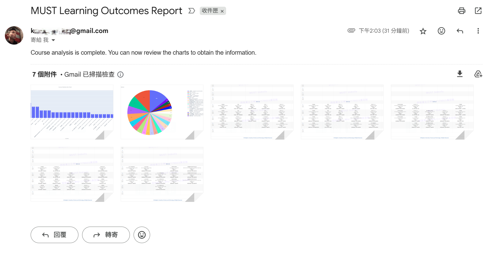

# Asyncio Course Fetcher

An asynchronous Python application that automates university course schedule retrieval, processing, and notification delivery. This project evolved from initial synchronous/asynchronous performance comparisons to become a fully-featured, production-ready course management system.



## Overview

This application automatically logs into the MUST University student portal, extracts course schedules across multiple semesters, processes the data for analysis, and delivers comprehensive reports through multiple notification channels.

## Architecture

The project follows a modular asynchronous architecture:

- **Main Application** (`asyncio_course_fetcher.py`) - Core workflow orchestration
- **Database Layer** (`sqltools.py`) - PostgreSQL operations with connection pooling
- **Notification System** (`notifiers.py`) - Multi-channel communication (Email, LINE, SMS)
- **Configuration** - Environment variables and YAML-based settings

## Key Features

### 🚀 Asynchronous Performance
- Fully async workflow using `asyncio` for optimal I/O handling
- Concurrent processing of login credentials and CAPTCHA recognition
- Non-blocking OCR processing in ThreadPoolExecutor
- Significant performance improvements over synchronous implementations

### 🔐 Automated Authentication
- Selenium WebDriver automation with undetected Chrome
- Advanced CAPTCHA recognition using PaddleOCR
- Image preprocessing (denoising, dilation) for enhanced OCR accuracy
- Intelligent retry mechanisms with exponential backoff

### 📊 Data Management
- PostgreSQL integration with asyncpg for high-performance database operations
- Automatic database schema creation and user privilege management
- UPSERT operations for data consistency
- Excel export functionality for offline analysis

### 📈 Analytics & Visualization
- Course distribution analysis with interactive charts
- Plotly-powered visualizations (pie charts, bar charts)
- Automatic chart generation and export

### 📱 Multi-Channel Notifications
- **Email**: SMTP with image attachments
- **LINE Bot**: Automated messaging with temporary image hosting
- **SMS**: Twilio integration for critical alerts

## Environment Requirements

- **Python**: 3.12.11 (exact version required)
- **Package Manager**: [uv](https://github.com/astral-sh/uv)
- **Database**: PostgreSQL 17
- **Browser**: Chrome (managed by undetected-chromedriver)

## Installation

1. **Clone the repository**
   ```bash
   git clone https://github.com/yourusername/asyncio-course-fetcher.git
   cd asyncio-course-fetcher
   ```

2. **Install dependencies**
   ```bash
   uv sync
   ```

3. **Configure environment variables**
   ```bash
   # Edit .env with your credentials
   ```

4. **Set up PostgreSQL**
   - Install PostgreSQL
   - Update database credentials in `.env`

## Usage

Run the application with a single command:

```bash
uv run asyncio_course_fetcher.py
```

The application will:
1. Initialize all components (OCR, WebDriver, Database)
2. Authenticate with the university portal
3. Navigate to course schedules
4. Extract data from all available semesters
5. Store data in PostgreSQL and Excel files
6. Generate analytical visualizations
7. Send notifications with results

## Output

### Generated Files
- `schedule.xlsx` - Excel workbook with course data by semester
- `courses_pie.html` / `courses_bar.html` - Interactive charts
- `./imgs/schedule_info_[year]-[semester].png` - Schedule screenshots
- `./imgs/courses_pie.png` / `courses_bar.png` - Chart images
- `Asyncio.log` - Detailed execution logs

## Technical Details

### OCR Processing
The application employs sophisticated image processing for CAPTCHA recognition:

1. **Screenshot Capture** - High-resolution element screenshots
2. **Preprocessing** - Grayscale conversion and binary thresholding
3. **Denoising** - Noise reduction for cleaner text extraction
4. **Dilation** - Character enhancement using morphological operations
5. **Recognition** - PaddleOCR with English language model

### Asynchronous Optimizations
- **Concurrent Input** - Account and password fields populated simultaneously
- **Background OCR** - CPU-intensive processing moved to thread pool
- **Connection Pooling** - Efficient database connection management
- **Transaction Management** - ACID compliance with proper rollback handling

### Error Handling
- Comprehensive exception handling with detailed logging
- Graceful degradation for failed notification channels
- Automatic retry mechanisms for transient failures
- Resource cleanup in finally blocks

## Development History

This project evolved through several phases:

1. **Initial Synchronous Version** - Basic functionality with sequential processing
2. **Performance Analysis** - Comparative testing between sync/async approaches
3. **Asynchronous Optimization** - Migration to asyncio with significant performance gains
4. **Feature Enhancement** - Added database integration, analytics, and notifications
5. **Production Hardening** - Comprehensive error handling and monitoring

## Known Issues & Considerations

### Environment-Specific OCR Variations
OCR accuracy may vary between different environments due to:
- Hardware differences (CPU/GPU variations)
- Display scaling and DPI settings
- OpenCV/Pillow version differences
- Screenshot resolution variations

**Mitigation Strategies:**
- Standardize library versions using `uv sync`
- Configure consistent browser window sizes
- Adjust preprocessing parameters for specific environments
- Monitor OCR success rates and fine-tune accordingly

### Browser Detection
- Uses `undetected-chromedriver` to avoid bot detection
- Randomized user agents for additional stealth
- May require updates as detection methods evolve

### Rate Limiting
- Implements random delays between operations
- Respects server response times
- May need adjustment for different network conditions

## Monitoring & Maintenance

### Logs
Comprehensive logging is available at multiple levels:
- **INFO**: General workflow progress
- **DEBUG**: Detailed operation traces
- **WARNING**: Non-critical issues
- **ERROR**: Failure conditions requiring attention

### Health Checks
Monitor these indicators for application health:
- Login success rates
- OCR recognition accuracy
- Database connection stability
- Notification delivery status

## License

This project is intended for educational and personal use. Ensure compliance with your institution's terms of service when using automated tools to access academic portals.

## Support

For issues related to:
- **OCR Recognition**: Check image preprocessing parameters
- **Database Connections**: Verify PostgreSQL configuration
- **Notifications**: Confirm API credentials and quotas
- **General Issues**: Check logs in `Asyncio.log` for detailed error information